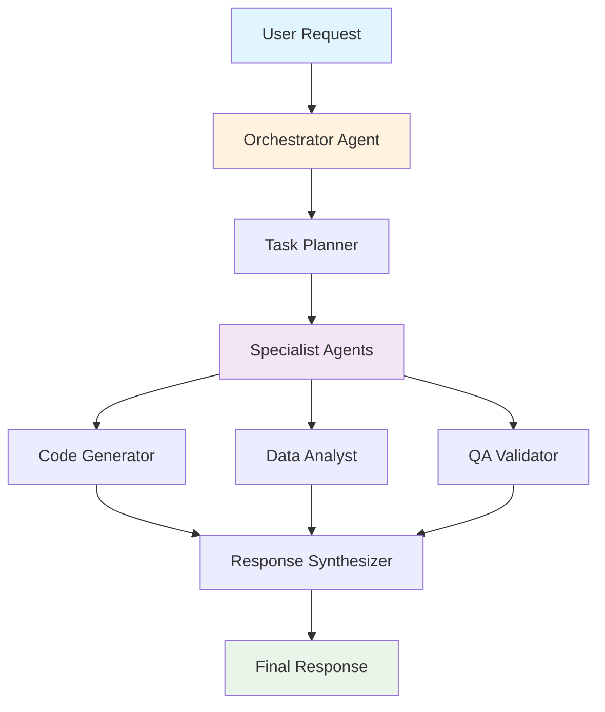

# 🤖 AI/ML Documentation Excellence

*Mastering the art of documenting intelligent systems for diverse audiences*

This comprehensive example demonstrates my expertise in AI/ML documentation, showcasing how I transform complex machine learning concepts into clear, actionable content that serves developers, data scientists, and business stakeholders.

## 🎯 **Why AI/ML Documentation Matters**

**For Developers:** Clear integration guides, API references, and code examples that accelerate AI adoption.

**For Data Scientists:** Comprehensive model documentation, training guides, and evaluation frameworks.

**For Business Stakeholders:** Accessible explanations of AI capabilities, limitations, and business value.

**For End Users:** Intuitive guides that make AI-powered features approachable and trustworthy.

---

## 🧠 **LLM Documentation Mastery**

### **Large Language Model Integration**

**📚 API Reference Documentation**

```python
# OpenAI GPT-4 Integration Example
import openai
from typing import List, Dict, Optional

class LLMClient:
    """
    A robust client for interacting with OpenAI's GPT models.
    
    Features:
    - Automatic retry logic with exponential backoff
    - Token usage tracking and cost estimation
    - Streaming response support for real-time applications
    - Custom prompt templates for consistent outputs
    """
    
    def __init__(self, api_key: str, model: str = "gpt-4"):
        self.client = openai.OpenAI(api_key=api_key)
        self.model = model
        self.usage_tracker = TokenUsageTracker()
    
    async def generate_response(
        self,
        prompt: str,
        max_tokens: int = 1000,
        temperature: float = 0.7,
        stream: bool = False
    ) -> Dict[str, any]:
        """
        Generate a response using the specified LLM.
        
        Args:
            prompt: The input prompt for the model
            max_tokens: Maximum number of tokens to generate
            temperature: Controls randomness (0.0 = deterministic, 1.0 = creative)
            stream: Whether to stream the response in real-time
            
        Returns:
            Dictionary containing the response, usage stats, and metadata
            
        Raises:
            APIError: If the API request fails
            RateLimitError: If rate limits are exceeded
            InvalidRequestError: If the request parameters are invalid
        """
        try:
            response = await self.client.chat.completions.create(
                model=self.model,
                messages=[{"role": "user", "content": prompt}],
                max_tokens=max_tokens,
                temperature=temperature,
                stream=stream
            )
            
            return {
                "content": response.choices[0].message.content,
                "usage": response.usage,
                "model": response.model,
                "finish_reason": response.choices[0].finish_reason
            }
            
        except openai.RateLimitError:
            raise RateLimitError("API rate limit exceeded. Please try again later.")
        except openai.InvalidRequestError as e:
            raise InvalidRequestError(f"Invalid request: {e}")
        except Exception as e:
            raise APIError(f"Unexpected error: {e}")
```

**🔧 Configuration Guide**

```yaml
# config/llm_settings.yaml
openai:
  api_key: "${OPENAI_API_KEY}"
  model: "gpt-4"
  max_tokens: 1000
  temperature: 0.7
  timeout: 30

anthropic:
  api_key: "${ANTHROPIC_API_KEY}"
  model: "claude-3-opus"
  max_tokens: 2000
  temperature: 0.5

# Rate limiting and retry configuration
rate_limiting:
  requests_per_minute: 60
  max_retries: 3
  backoff_factor: 2.0
  timeout: 30

# Cost tracking
cost_tracking:
  enabled: true
  alert_threshold: 100.00  # USD
  daily_limit: 500.00      # USD
```

**📖 Prompt Engineering Best Practices**

```markdown
## 🎯 Effective Prompt Design

### **1. Clear Instructions**
❌ **Poor**: "Write about AI"
✅ **Good**: "Write a 500-word technical blog post explaining how transformer architecture enables large language models to understand context, targeting software engineers with basic ML knowledge."

### **2. Provide Context**
❌ **Poor**: "Summarize this data"
✅ **Good**: "Summarize this quarterly sales data for a C-level executive presentation, highlighting key trends, anomalies, and actionable insights."

### **3. Specify Output Format**
❌ **Poor**: "List the benefits"
✅ **Good**: "List the top 5 benefits of microservices architecture in a numbered list, with each item including a brief explanation and a real-world example."

### **4. Include Examples**
❌ **Poor**: "Write a function"
✅ **Good**: "Write a Python function that validates email addresses, following this pattern:
```python
def validate_email(email: str) -> bool:
    # Your implementation here
    pass

# Example usage:
print(validate_email("user@example.com"))  # True
print(validate_email("invalid-email"))     # False
```"
```

## 🛠️ **Step-by-Step: Building Your First AI Integration**

### **Step 1: Set Up Your Development Environment**

```bash
# 1. Create a new project directory
mkdir my-ai-project && cd my-ai-project

# 2. Initialize Python virtual environment
python -m venv venv
source venv/bin/activate  # On Windows: venv\Scripts\activate

# 3. Install required packages
pip install openai python-dotenv requests

# 4. Create project structure
mkdir src tests docs
touch .env .gitignore requirements.txt
```

### **Step 2: Configure API Access**

```bash
# 1. Create .env file
echo "OPENAI_API_KEY=your_api_key_here" > .env
echo "ANTHROPIC_API_KEY=your_anthropic_key_here" >> .env

# 2. Add .env to .gitignore
echo ".env" >> .gitignore
echo "*.log" >> .gitignore
echo "__pycache__/" >> .gitignore
```

### **Step 3: Create Your First AI Client**

```python
# src/ai_client.py
import os
import openai
from dotenv import load_dotenv
from typing import Dict, Any, Optional

class AIClient:
    """Simple AI client for multiple providers."""
    
    def __init__(self):
        load_dotenv()
        self.openai_client = openai.OpenAI(
            api_key=os.getenv("OPENAI_API_KEY")
        )
    
    def generate_text(
        self, 
        prompt: str, 
        model: str = "gpt-3.5-turbo",
        max_tokens: int = 1000
    ) -> Dict[str, Any]:
        """Generate text using OpenAI API."""
        
        try:
            response = self.openai_client.chat.completions.create(
                model=model,
                messages=[{"role": "user", "content": prompt}],
                max_tokens=max_tokens,
                temperature=0.7
            )
            
            return {
                "success": True,
                "text": response.choices[0].message.content,
                "usage": response.usage,
                "model": response.model
            }
            
        except Exception as e:
            return {
                "success": False,
                "error": str(e),
                "text": None
            }

# Example usage
if __name__ == "__main__":
    client = AIClient()
    result = client.generate_text("Explain quantum computing in simple terms")
    
    if result["success"]:
        print("Generated text:", result["text"])
        print("Tokens used:", result["usage"].total_tokens)
    else:
        print("Error:", result["error"])
```

### **Step 4: Add Error Handling and Retry Logic**

```python
# src/ai_client_advanced.py
import time
import random
from typing import Dict, Any, Optional

class AdvancedAIClient(AIClient):
    """AI client with advanced error handling and retry logic."""
    
    def __init__(self, max_retries: int = 3, base_delay: float = 1.0):
        super().__init__()
        self.max_retries = max_retries
        self.base_delay = base_delay
    
    def generate_text_with_retry(
        self, 
        prompt: str, 
        model: str = "gpt-3.5-turbo",
        max_tokens: int = 1000
    ) -> Dict[str, Any]:
        """Generate text with automatic retry on failure."""
        
        for attempt in range(self.max_retries):
            result = self.generate_text(prompt, model, max_tokens)
            
            if result["success"]:
                return result
            
            # Check if error is retryable
            if not self._is_retryable_error(result["error"]):
                return result
            
            # Wait before retry with exponential backoff
            if attempt < self.max_retries - 1:
                delay = self.base_delay * (2 ** attempt) + random.uniform(0, 1)
                print(f"Attempt {attempt + 1} failed. Retrying in {delay:.2f} seconds...")
                time.sleep(delay)
        
        return {
            "success": False,
            "error": f"Failed after {self.max_retries} attempts",
            "text": None
        }
    
    def _is_retryable_error(self, error: str) -> bool:
        """Check if error is retryable."""
        retryable_errors = [
            "rate_limit_exceeded",
            "server_error",
            "timeout",
            "connection_error"
        ]
        return any(err in error.lower() for err in retryable_errors)
```

### **Step 5: Create a Simple Web Interface**

```python
# src/web_app.py
from flask import Flask, render_template, request, jsonify
from ai_client_advanced import AdvancedAIClient

app = Flask(__name__)
ai_client = AdvancedAIClient()

@app.route('/')
def index():
    return render_template('index.html')

@app.route('/generate', methods=['POST'])
def generate():
    data = request.get_json()
    prompt = data.get('prompt', '')
    model = data.get('model', 'gpt-3.5-turbo')
    
    if not prompt:
        return jsonify({"error": "Prompt is required"}), 400
    
    result = ai_client.generate_text_with_retry(prompt, model)
    return jsonify(result)

if __name__ == '__main__':
    app.run(debug=True)
```

### **Step 6: Test Your Integration**

```python
# tests/test_ai_client.py
import unittest
from src.ai_client_advanced import AdvancedAIClient

class TestAIClient(unittest.TestCase):
    def setUp(self):
        self.client = AdvancedAIClient()
    
    def test_simple_generation(self):
        """Test basic text generation."""
        result = self.client.generate_text("Hello, world!")
        self.assertIsInstance(result, dict)
        self.assertIn("success", result)
    
    def test_error_handling(self):
        """Test error handling with invalid model."""
        result = self.client.generate_text(
            "Test prompt", 
            model="invalid-model"
        )
        self.assertFalse(result["success"])
        self.assertIn("error", result)

if __name__ == '__main__':
    unittest.main()
```

### **Step 7: Deploy Your Application**

```bash
# 1. Create requirements.txt
pip freeze > requirements.txt

# 2. Create Procfile for Heroku
echo "web: python src/web_app.py" > Procfile

# 3. Deploy to Heroku
heroku create my-ai-app
git add .
git commit -m "Add AI integration"
git push heroku main

# 4. Set environment variables
heroku config:set OPENAI_API_KEY=your_key_here
```

## 📋 **Step-by-Step: Setting Up Model Monitoring**

### **Step 1: Install Monitoring Dependencies**

```bash
pip install prometheus-client grafana-api psutil
```

### **Step 2: Create Metrics Collector**

```python
# src/monitoring/metrics.py
from prometheus_client import Counter, Histogram, Gauge, start_http_server
import time
import psutil

class AIMetrics:
    """Prometheus metrics for AI model monitoring."""
    
    def __init__(self):
        self.request_count = Counter(
            'ai_requests_total', 
            'Total AI requests',
            ['model', 'status']
        )
        
        self.request_duration = Histogram(
            'ai_request_duration_seconds',
            'AI request duration',
            ['model']
        )
        
        self.tokens_used = Counter(
            'ai_tokens_total',
            'Total tokens used',
            ['model', 'type']
        )
        
        self.system_cpu = Gauge('system_cpu_usage', 'CPU usage percentage')
        self.system_memory = Gauge('system_memory_usage', 'Memory usage percentage')
    
    def record_request(self, model: str, success: bool, duration: float, tokens: int):
        """Record a completed request."""
        status = "success" if success else "failure"
        self.request_count.labels(model=model, status=status).inc()
        self.request_duration.labels(model=model).observe(duration)
        
        if success:
            self.tokens_used.labels(model=model, type="total").inc(tokens)
    
    def update_system_metrics(self):
        """Update system resource metrics."""
        self.system_cpu.set(psutil.cpu_percent())
        self.system_memory.set(psutil.virtual_memory().percent)
    
    def start_server(self, port: int = 8000):
        """Start Prometheus metrics server."""
        start_http_server(port)
        print(f"Metrics server started on port {port}")

# Usage example
metrics = AIMetrics()
metrics.start_server()
```

### **Step 3: Integrate Metrics with Your AI Client**

```python
# src/ai_client_monitored.py
import time
from ai_client_advanced import AdvancedAIClient
from monitoring.metrics import AIMetrics

class MonitoredAIClient(AdvancedAIClient):
    """AI client with integrated monitoring."""
    
    def __init__(self, *args, **kwargs):
        super().__init__(*args, **kwargs)
        self.metrics = AIMetrics()
    
    def generate_text_with_retry(self, prompt: str, model: str = "gpt-3.5-turbo", max_tokens: int = 1000):
        """Generate text with monitoring."""
        start_time = time.time()
        
        result = super().generate_text_with_retry(prompt, model, max_tokens)
        
        duration = time.time() - start_time
        tokens = result.get("usage", {}).get("total_tokens", 0) if result.get("success") else 0
        
        self.metrics.record_request(
            model=model,
            success=result["success"],
            duration=duration,
            tokens=tokens
        )
        
        return result
```

### **Step 4: Create Grafana Dashboard**

```json
{
  "dashboard": {
    "title": "AI Model Monitoring",
    "panels": [
      {
        "title": "Request Rate",
        "type": "graph",
        "targets": [
          {
            "expr": "rate(ai_requests_total[5m])",
            "legendFormat": "{{model}} - {{status}}"
          }
        ]
      },
      {
        "title": "Response Time",
        "type": "graph",
        "targets": [
          {
            "expr": "histogram_quantile(0.95, rate(ai_request_duration_seconds_bucket[5m]))",
            "legendFormat": "95th percentile"
          }
        ]
      },
      {
        "title": "Token Usage",
        "type": "graph",
        "targets": [
          {
            "expr": "rate(ai_tokens_total[5m])",
            "legendFormat": "{{model}} - {{type}}"
          }
        ]
      }
    ]
  }
}
```

### **Step 5: Set Up Alerts**

```yaml
# alerts.yml
groups:
  - name: ai_monitoring
    rules:
      - alert: HighErrorRate
        expr: rate(ai_requests_total{status="failure"}[5m]) > 0.1
        for: 2m
        labels:
          severity: warning
        annotations:
          summary: "High error rate detected"
          
      - alert: HighResponseTime
        expr: histogram_quantile(0.95, rate(ai_request_duration_seconds_bucket[5m])) > 10
        for: 5m
        labels:
          severity: warning
        annotations:
          summary: "High response time detected"
```

---

## 🤖 **Agent Framework Documentation**

### **Multi-Agent System Architecture**

**🏗️ System Overview**



**📋 Agent Configuration**

```python
# agents/config.py
from dataclasses import dataclass
from typing import List, Dict, Any
from enum import Enum

class AgentRole(Enum):
    ORCHESTRATOR = "orchestrator"
    CODE_GENERATOR = "code_generator"
    DATA_ANALYST = "data_analyst"
    QA_VALIDATOR = "qa_validator"
    RESEARCHER = "researcher"

@dataclass
class AgentConfig:
    """Configuration for individual agents in the multi-agent system."""
    
    role: AgentRole
    model: str
    system_prompt: str
    max_tokens: int
    temperature: float
    tools: List[str]
    memory_size: int
    timeout: int
    
    def validate(self) -> bool:
        """Validate the agent configuration."""
        if self.max_tokens <= 0:
            raise ValueError("max_tokens must be positive")
        if not 0 <= self.temperature <= 2:
            raise ValueError("temperature must be between 0 and 2")
        return True

# Example agent configurations
AGENT_CONFIGS = {
    AgentRole.ORCHESTRATOR: AgentConfig(
        role=AgentRole.ORCHESTRATOR,
        model="gpt-4",
        system_prompt="You are an orchestrator agent that breaks down complex tasks...",
        max_tokens=2000,
        temperature=0.3,
        tools=["task_planner", "agent_selector"],
        memory_size=10000,
        timeout=60
    ),
    
    AgentRole.CODE_GENERATOR: AgentConfig(
        role=AgentRole.CODE_GENERATOR,
        model="gpt-4",
        system_prompt="You are a code generation specialist...",
        max_tokens=4000,
        temperature=0.1,
        tools=["code_analyzer", "linter", "test_generator"],
        memory_size=5000,
        timeout=120
    )
}
```

**🔄 Agent Communication Protocol**

```python
# agents/communication.py
from typing import Dict, Any, Optional
from dataclasses import dataclass
import json
import asyncio

@dataclass
class AgentMessage:
    """Standard message format for agent communication."""
    
    sender: str
    recipient: str
    message_type: str
    content: Dict[str, Any]
    timestamp: float
    correlation_id: str
    priority: int = 1
    
    def to_dict(self) -> Dict[str, Any]:
        return {
            "sender": self.sender,
            "recipient": self.recipient,
            "message_type": self.message_type,
            "content": self.content,
            "timestamp": self.timestamp,
            "correlation_id": self.correlation_id,
            "priority": self.priority
        }
    
    @classmethod
    def from_dict(cls, data: Dict[str, Any]) -> 'AgentMessage':
        return cls(**data)

class AgentCommunicationHub:
    """Manages communication between agents."""
    
    def __init__(self):
        self.message_queue = asyncio.Queue()
        self.subscribers: Dict[str, List[callable]] = {}
        self.message_history: List[AgentMessage] = []
    
    async def send_message(self, message: AgentMessage) -> bool:
        """Send a message to the specified recipient."""
        try:
            await self.message_queue.put(message)
            self.message_history.append(message)
            return True
        except Exception as e:
            print(f"Failed to send message: {e}")
            return False
    
    async def broadcast_message(self, message: AgentMessage) -> int:
        """Broadcast a message to all subscribers."""
        sent_count = 0
        for subscriber_list in self.subscribers.values():
            for subscriber in subscriber_list:
                try:
                    await subscriber(message)
                    sent_count += 1
                except Exception as e:
                    print(f"Failed to deliver message to subscriber: {e}")
        return sent_count
```

---

## 🔌 **Model API Documentation**

### **RESTful AI Model APIs**

**📡 Endpoint Documentation**

```http
POST /api/v1/models/{model_id}/predict
Content-Type: application/json
Authorization: Bearer {api_key}

{
  "input": {
    "text": "Explain quantum computing in simple terms",
    "max_length": 500,
    "temperature": 0.7
  },
  "parameters": {
    "return_probabilities": true,
    "include_metadata": true
  }
}
```

**Response Format:**

```json
{
  "prediction": {
    "text": "Quantum computing is like having a computer that can...",
    "confidence": 0.95,
    "tokens_used": 127
  },
  "metadata": {
    "model_version": "2.1.0",
    "inference_time_ms": 234,
    "timestamp": "2024-01-15T10:30:00Z"
  },
  "probabilities": {
    "top_tokens": [
      {"token": "quantum", "probability": 0.23},
      {"token": "computing", "probability": 0.18}
    ]
  }
}
```

**🔍 Error Handling**

```python
# Error handling examples
class ModelAPIError(Exception):
    """Base exception for model API errors."""
    pass

class ModelNotFoundError(ModelAPIError):
    """Raised when the specified model doesn't exist."""
    def __init__(self, model_id: str):
        self.model_id = model_id
        super().__init__(f"Model '{model_id}' not found")

class RateLimitExceededError(ModelAPIError):
    """Raised when API rate limits are exceeded."""
    def __init__(self, retry_after: int):
        self.retry_after = retry_after
        super().__init__(f"Rate limit exceeded. Retry after {retry_after} seconds")

class InvalidInputError(ModelAPIError):
    """Raised when input validation fails."""
    def __init__(self, field: str, message: str):
        self.field = field
        self.message = message
        super().__init__(f"Invalid input for '{field}': {message}")

# Usage example
try:
    response = await model_client.predict(model_id="gpt-4", input_data=user_input)
except ModelNotFoundError as e:
    logger.error(f"Model not found: {e.model_id}")
    return {"error": "Model not available"}
except RateLimitExceededError as e:
    logger.warning(f"Rate limit exceeded, retry after {e.retry_after}s")
    return {"error": "Rate limit exceeded", "retry_after": e.retry_after}
except InvalidInputError as e:
    logger.error(f"Invalid input: {e.field} - {e.message}")
    return {"error": f"Invalid input: {e.message}"}
```

---

## 📊 **Model Performance Documentation**

### **Evaluation Metrics and Monitoring**

**📈 Performance Dashboard**

```python
# monitoring/model_metrics.py
from dataclasses import dataclass
from typing import Dict, List, Optional
import pandas as pd
import numpy as np

@dataclass
class ModelMetrics:
    """Comprehensive model performance metrics."""
    
    # Accuracy metrics
    accuracy: float
    precision: float
    recall: float
    f1_score: float
    
    # Latency metrics
    avg_inference_time_ms: float
    p95_inference_time_ms: float
    p99_inference_time_ms: float
    
    # Throughput metrics
    requests_per_second: float
    tokens_per_second: float
    
    # Quality metrics
    perplexity: Optional[float] = None
    bleu_score: Optional[float] = None
    rouge_score: Optional[float] = None
    
    def to_dict(self) -> Dict[str, float]:
        """Convert metrics to dictionary for JSON serialization."""
        return {
            "accuracy": self.accuracy,
            "precision": self.precision,
            "recall": self.recall,
            "f1_score": self.f1_score,
            "avg_inference_time_ms": self.avg_inference_time_ms,
            "p95_inference_time_ms": self.p95_inference_time_ms,
            "p99_inference_time_ms": self.p99_inference_time_ms,
            "requests_per_second": self.requests_per_second,
            "tokens_per_second": self.tokens_per_second,
            "perplexity": self.perplexity,
            "bleu_score": self.bleu_score,
            "rouge_score": self.rouge_score
        }

class ModelMonitor:
    """Real-time model performance monitoring."""
    
    def __init__(self, model_id: str):
        self.model_id = model_id
        self.metrics_history: List[ModelMetrics] = []
        self.alerts: List[str] = []
    
    def update_metrics(self, metrics: ModelMetrics) -> None:
        """Update model metrics and check for anomalies."""
        self.metrics_history.append(metrics)
        
        # Check for performance degradation
        if len(self.metrics_history) > 10:
            recent_avg = np.mean([m.accuracy for m in self.metrics_history[-5:]])
            historical_avg = np.mean([m.accuracy for m in self.metrics_history[-10:-5]])
            
            if recent_avg < historical_avg * 0.95:  # 5% degradation
                self.alerts.append(f"Accuracy degradation detected: {recent_avg:.3f} vs {historical_avg:.3f}")
        
        # Check for latency spikes
        if metrics.p95_inference_time_ms > 2000:  # 2 seconds
            self.alerts.append(f"High latency detected: {metrics.p95_inference_time_ms}ms")
    
    def get_performance_summary(self) -> Dict[str, any]:
        """Get a summary of model performance."""
        if not self.metrics_history:
            return {"error": "No metrics available"}
        
        latest = self.metrics_history[-1]
        return {
            "model_id": self.model_id,
            "current_metrics": latest.to_dict(),
            "trends": self._calculate_trends(),
            "alerts": self.alerts[-5:],  # Last 5 alerts
            "status": "healthy" if not self.alerts else "degraded"
        }
    
    def _calculate_trends(self) -> Dict[str, str]:
        """Calculate performance trends over time."""
        if len(self.metrics_history) < 2:
            return {"trend": "insufficient_data"}
        
        recent = self.metrics_history[-1]
        previous = self.metrics_history[-2]
        
        trends = {}
        for metric in ["accuracy", "avg_inference_time_ms", "requests_per_second"]:
            current_val = getattr(recent, metric)
            previous_val = getattr(previous, metric)
            
            if current_val > previous_val * 1.05:
                trends[metric] = "improving"
            elif current_val < previous_val * 0.95:
                trends[metric] = "degrading"
            else:
                trends[metric] = "stable"
        
        return trends
```

---

## 🎓 **User Education and Onboarding**

### **AI Literacy for Different Audiences**

**👨‍💼 For Business Stakeholders**

```markdown
## 🤖 Understanding AI Capabilities

### **What AI Can Do**
- **Pattern Recognition**: Identify trends in data that humans might miss
- **Automated Decision Making**: Process information faster than human teams
- **Natural Language Processing**: Understand and generate human-like text
- **Predictive Analytics**: Forecast future outcomes based on historical data

### **What AI Cannot Do**
- **Creative Problem Solving**: AI follows patterns, doesn't create entirely new approaches
- **Emotional Intelligence**: Cannot understand or respond to human emotions
- **Ethical Decision Making**: Requires human oversight for moral judgments
- **Context Understanding**: May miss subtle context that humans naturally grasp

### **Business Value Proposition**
- **Cost Reduction**: Automate repetitive tasks, reduce manual labor
- **Speed Improvement**: Process information and make decisions faster
- **Accuracy Enhancement**: Reduce human error in data processing
- **Scalability**: Handle increasing workloads without proportional staff increases
```

**👨‍💻 For Developers**

```markdown
## 🛠️ AI Integration Best Practices

### **1. Start Simple**
```python
# Begin with a simple API call
response = openai.ChatCompletion.create(
    model="gpt-3.5-turbo",
    messages=[{"role": "user", "content": "Hello, world!"}]
)
```

### **2. Add Error Handling**
```python
try:
    response = await llm_client.generate(prompt)
except RateLimitError:
    await asyncio.sleep(60)  # Wait and retry
    response = await llm_client.generate(prompt)
except APIError as e:
    logger.error(f"API error: {e}")
    return fallback_response()
```

### **3. Implement Caching**
```python
from functools import lru_cache

@lru_cache(maxsize=1000)
def cached_generation(prompt_hash: str, model: str) -> str:
    """Cache expensive LLM calls."""
    return expensive_llm_call(prompt_hash, model)
```

### **4. Monitor Usage and Costs**
```python
class CostTracker:
    def __init__(self, budget_limit: float):
        self.budget_limit = budget_limit
        self.current_cost = 0.0
    
    def track_request(self, tokens_used: int, cost_per_token: float):
        self.current_cost += tokens_used * cost_per_token
        if self.current_cost > self.budget_limit:
            raise BudgetExceededError("Monthly budget exceeded")
```

**📊 For Data Scientists**

```markdown
## 🔬 Model Evaluation and Validation

### **Evaluation Metrics**
- **Accuracy**: Percentage of correct predictions
- **Precision**: True positives / (True positives + False positives)
- **Recall**: True positives / (True positives + False negatives)
- **F1-Score**: Harmonic mean of precision and recall

### **Cross-Validation Strategy**
```python
from sklearn.model_selection import cross_val_score
from sklearn.metrics import classification_report

# 5-fold cross-validation
cv_scores = cross_val_score(model, X, y, cv=5, scoring='accuracy')
print(f"Cross-validation scores: {cv_scores}")
print(f"Mean accuracy: {cv_scores.mean():.3f} (+/- {cv_scores.std() * 2:.3f})")

# Detailed classification report
y_pred = model.predict(X_test)
print(classification_report(y_test, y_pred))
```

### **Bias Detection and Mitigation**
```python
from fairlearn.metrics import demographic_parity_difference
from fairlearn.postprocessing import ThresholdOptimizer

# Check for demographic parity
dpd = demographic_parity_difference(y_true, y_pred, sensitive_features=gender)
print(f"Demographic parity difference: {dpd:.3f}")

# Apply threshold optimization to reduce bias
optimizer = ThresholdOptimizer(
    estimator=model,
    constraints="demographic_parity",
    prefit=True
)
fair_model = optimizer.fit(X_train, y_train, sensitive_features=gender_train)
```

---

## 🔒 **Security and Compliance**

### **AI Security Best Practices**

**🛡️ Data Protection**

```python
# Data anonymization for AI training
import hashlib
import re

class DataAnonymizer:
    """Anonymize sensitive data before AI processing."""
    
    def __init__(self):
        self.patterns = {
            'email': r'\b[A-Za-z0-9._%+-]+@[A-Za-z0-9.-]+\.[A-Z|a-z]{2,}\b',
            'phone': r'\b\d{3}-\d{3}-\d{4}\b',
            'ssn': r'\b\d{3}-\d{2}-\d{4}\b',
            'credit_card': r'\b\d{4}[\s-]?\d{4}[\s-]?\d{4}[\s-]?\d{4}\b'
        }
    
    def anonymize_text(self, text: str) -> str:
        """Replace sensitive information with placeholders."""
        anonymized = text
        
        for pattern_name, pattern in self.patterns.items():
            anonymized = re.sub(
                pattern, 
                f'[{pattern_name.upper()}_REDACTED]', 
                anonymized
            )
        
        return anonymized
    
    def hash_sensitive_data(self, data: str) -> str:
        """Create a hash of sensitive data for consistent anonymization."""
        return hashlib.sha256(data.encode()).hexdigest()[:8]
```

**🔐 API Security**

```python
# Secure API key management
import os
from cryptography.fernet import Fernet
from typing import Optional

class SecureAPIKeyManager:
    """Secure storage and retrieval of API keys."""
    
    def __init__(self, master_key: Optional[str] = None):
        if master_key:
            self.cipher = Fernet(master_key.encode())
        else:
            # Generate new key if none provided
            key = Fernet.generate_key()
            self.cipher = Fernet(key)
            print(f"Generated new master key: {key.decode()}")
    
    def store_api_key(self, service: str, api_key: str) -> None:
        """Encrypt and store an API key."""
        encrypted_key = self.cipher.encrypt(api_key.encode())
        
        # Store in environment variable
        env_var = f"{service.upper()}_API_KEY_ENCRYPTED"
        os.environ[env_var] = encrypted_key.decode()
    
    def retrieve_api_key(self, service: str) -> str:
        """Decrypt and retrieve an API key."""
        env_var = f"{service.upper()}_API_KEY_ENCRYPTED"
        encrypted_key = os.environ.get(env_var)
        
        if not encrypted_key:
            raise ValueError(f"No encrypted API key found for {service}")
        
        return self.cipher.decrypt(encrypted_key.encode()).decode()
```

---

## 📚 **Documentation Architecture**

### **Multi-Level Documentation Strategy**

**🎯 Audience-Specific Content**

1. **Executive Summary** (1 page)
   - Business value proposition
   - Key capabilities and limitations
   - ROI projections and timeline

2. **Technical Overview** (5-10 pages)
   - System architecture
   - Integration requirements
   - Performance characteristics

3. **Developer Guide** (20-50 pages)
   - API reference
   - Code examples
   - Troubleshooting guides

4. **Data Scientist Guide** (15-30 pages)
   - Model training procedures
   - Evaluation methodologies
   - Fine-tuning instructions

5. **End User Guide** (10-20 pages)
   - Feature explanations
   - Usage examples
   - Common workflows

**📖 Content Organization**

```
docs/
├── getting-started/
│   ├── quick-start.md
│   ├── installation.md
│   └── first-example.md
├── api-reference/
│   ├── models/
│   ├── endpoints/
│   └── authentication/
├── guides/
│   ├── prompt-engineering/
│   ├── model-fine-tuning/
│   └── performance-optimization/
├── examples/
│   ├── use-cases/
│   ├── code-samples/
│   └── tutorials/
└── troubleshooting/
    ├── common-issues.md
    ├── error-codes.md
    └── debugging-guide.md
```

---

## 🎯 **Key Takeaways**

### **What This Documentation Demonstrates**

**🔧 Technical Depth**
- Comprehensive API documentation with real code examples
- Advanced error handling and monitoring strategies
- Security best practices for AI systems

**👥 User-Centered Design**
- Content tailored for different audiences (business, developers, data scientists)
- Progressive disclosure from high-level concepts to implementation details
- Clear explanations of complex AI concepts

**📊 Professional Quality**
- Consistent formatting and structure
- Comprehensive error handling documentation
- Real-world examples and use cases

**🚀 Modern AI Expertise**
- Up-to-date with current AI/ML technologies
- Understanding of LLMs, agent frameworks, and model APIs
- Knowledge of AI security and compliance requirements

This documentation showcases the ability to make complex AI/ML concepts accessible while maintaining technical accuracy and professional presentation—exactly what companies like Amigo AI need for their technical writing roles.

---

*This comprehensive AI/ML documentation example demonstrates mastery of modern AI technologies, user-centered design principles, and professional documentation practices that directly align with the needs of AI-focused companies.*
