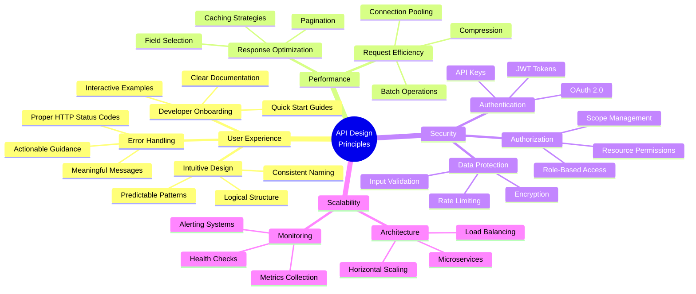
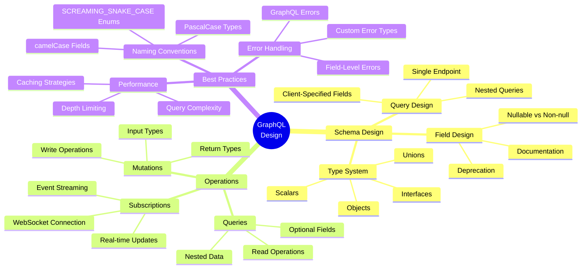
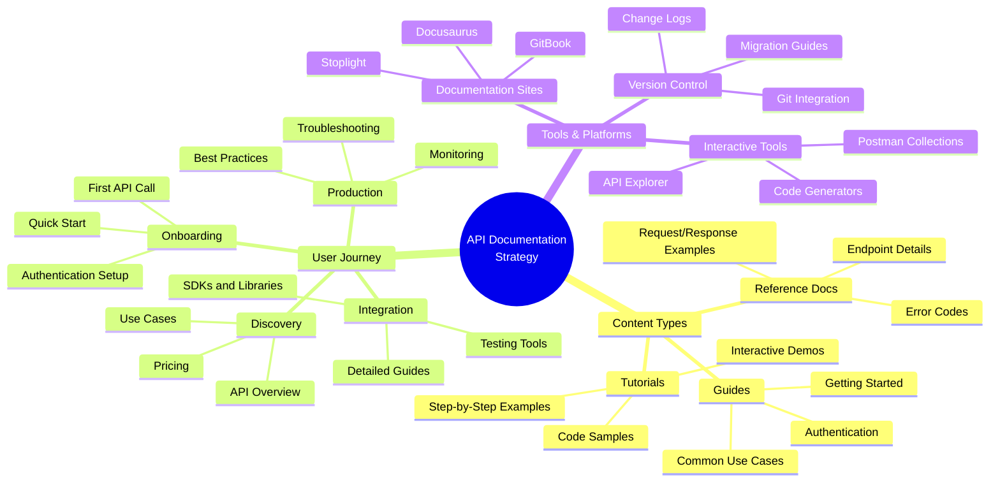
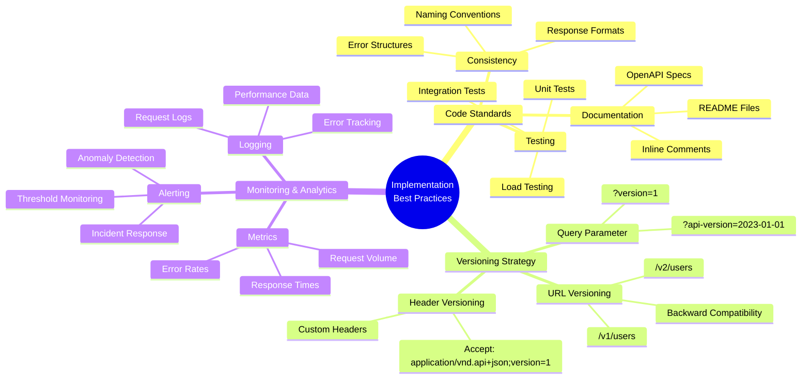
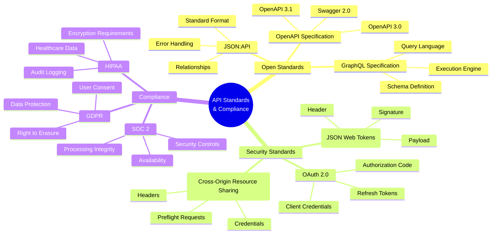
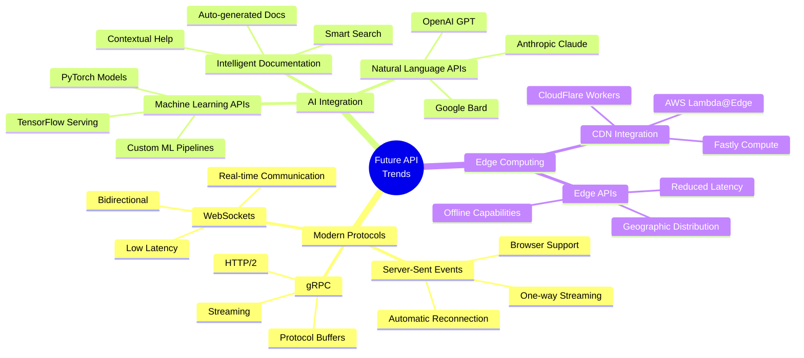

# API Design Principles Mind Map

This interactive mind map demonstrates my understanding of API design principles and best practices through visual learning techniques.

## Overview

API design is both an art and a science, requiring deep understanding of user needs, technical constraints, and industry standards. This mind map breaks down the complex ecosystem of API design into digestible, interconnected concepts.

## 🧠 API Design Mind Map

### Core Design Principles



## 🔄 REST vs GraphQL Comparison

### REST API Design Patterns

```mermaid
mindmap
  root((REST API<br/>Design))
    Resource Design
      Nouns Not Verbs
        /users not /getUsers
        /orders not /createOrder
        /products not /fetchProducts
      Hierarchical Structure
        /users/{id}/orders
        /products/{id}/reviews
        /organizations/{id}/members
      Plural Nouns
        /users not /user
        /products not /product
        /orders not /order
    HTTP Methods
      GET
        Retrieve Resources
        Idempotent
        Cacheable
      POST
        Create Resources
        Non-idempotent
        Request Body
      PUT
        Update/Replace
        Idempotent
        Complete Resource
      PATCH
        Partial Updates
        Idempotent
        Specific Fields
      DELETE
        Remove Resources
        Idempotent
        No Body
    Status Codes
      2xx Success
        200 OK
        201 Created
        204 No Content
      4xx Client Error
        400 Bad Request
        401 Unauthorized
        404 Not Found
      5xx Server Error
        500 Internal Server Error
        503 Service Unavailable
```

### GraphQL Design Patterns



## 🎯 API Documentation Strategy

### Documentation Architecture



## 🔧 Implementation Best Practices

### Code Quality & Standards



## 🌐 Industry Standards & Compliance

### API Standards Ecosystem



## 🚀 Future Trends & Innovation

### Emerging API Technologies



## 📊 Visual Learning Benefits

### Why Mind Maps Work for API Design

**🧠 Cognitive Benefits:**
- **Pattern Recognition**: Visual connections help identify relationships between concepts
- **Memory Retention**: Color-coded, spatial organization improves recall
- **Quick Reference**: Easy to scan and find specific information
- **Holistic Understanding**: See the big picture while understanding details

**👥 Team Collaboration:**
- **Shared Mental Models**: Align team understanding of API design principles
- **Onboarding Tool**: Help new developers understand complex concepts quickly
- **Design Reviews**: Visual representation of design decisions and trade-offs
- **Documentation**: Living diagrams that evolve with the API

**🎯 Practical Applications:**
- **API Planning**: Use mind maps during initial design phases
- **Documentation**: Create visual guides for complex API ecosystems
- **Training**: Develop interactive learning materials for teams
- **Troubleshooting**: Map out common issues and solutions

## 🛠️ Tools for Creating API Mind Maps

### Recommended Platforms

**Mermaid Integration:**
- **Docusaurus**: Native support for Mermaid diagrams
- **GitHub**: Renders Mermaid in README files
- **Notion**: Supports Mermaid blocks
- **GitLab**: Built-in Mermaid support

**Dedicated Mind Mapping Tools:**
- **Miro**: Collaborative whiteboarding with API templates
- **Lucidchart**: Professional diagramming with API shapes
- **Draw.io**: Free, open-source diagramming tool
- **XMind**: Specialized mind mapping software

**Code-First Approaches:**
- **Mermaid**: Text-based diagram generation
- **PlantUML**: UML diagrams for API design
- **C4 Model**: Architecture diagrams for microservices
- **D3.js**: Custom interactive visualizations

---

*This mind map demonstrates my ability to break down complex technical concepts into visual, digestible formats that enhance understanding and facilitate team collaboration. The interactive nature of these diagrams makes them perfect for both learning and reference purposes.*
