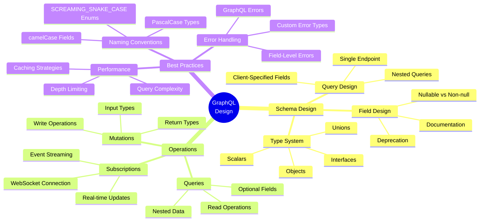
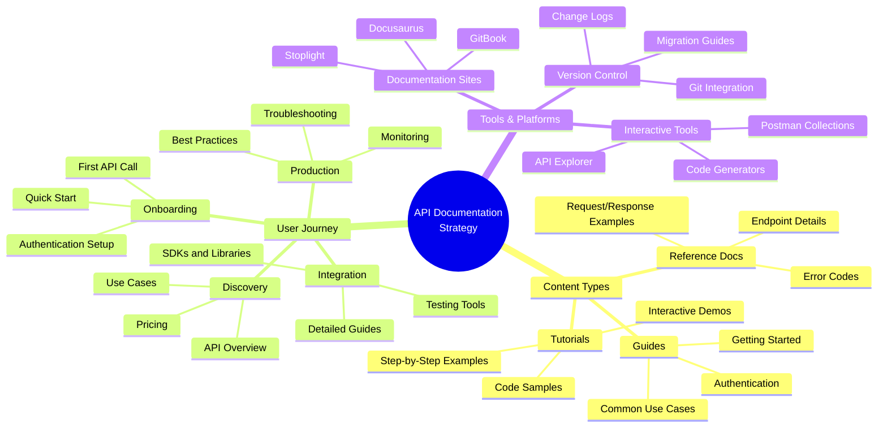
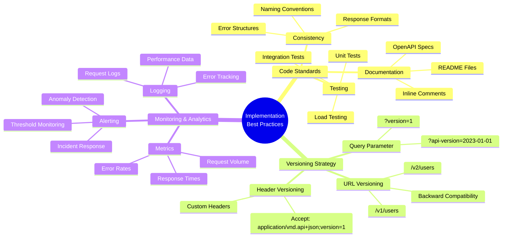
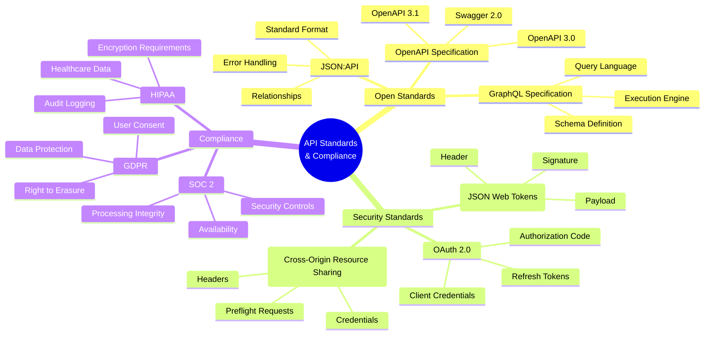
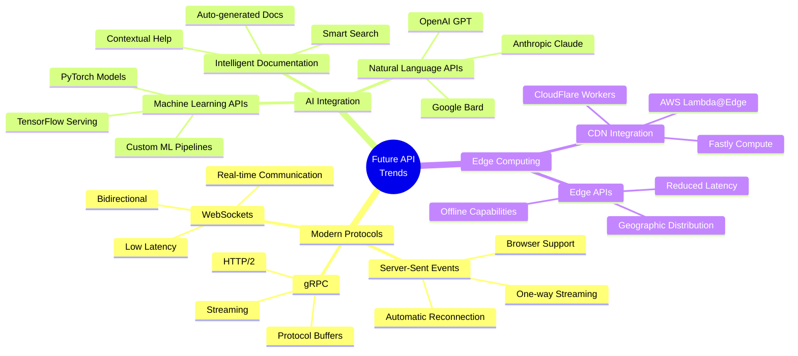

# 🚀 API Design Principles Mind Map

*Master the art and science of modern API design through visual learning*

This comprehensive mind map demonstrates my deep understanding of API design principles and best practices, showcasing how complex technical concepts can be transformed into intuitive, visual learning experiences.

## 🎯 **Why This Mind Map Matters**

**For Technical Writers:** This demonstrates my ability to break down complex technical concepts into digestible, visual formats that enhance understanding and facilitate team collaboration.

**For Developers:** This serves as a comprehensive reference for API design best practices, covering everything from user experience to scalability considerations.

**For Teams:** This visual approach helps align understanding across different roles and experience levels, making it an invaluable tool for design reviews and onboarding.

---

## 🧠 **Interactive API Design Ecosystem**

<div className="api-mindmap-container">
  <div className="mindmap-center">
    <div className="center-node">
      <div className="node-icon">🚀</div>
      <div className="node-title">API Design Principles</div>
      <div className="node-subtitle">Modern • Scalable • User-Focused</div>
      <div className="node-description">The foundation of exceptional API experiences</div>
    </div>
  </div>
  
  <div className="mindmap-branches">
    <div className="branch branch-1">
      <div className="branch-header">
        <div className="branch-icon">👥</div>
        <div className="branch-title">User Experience</div>
        <div className="branch-subtitle">Developer-First Design</div>
      </div>
      <div className="branch-items">
        <div className="branch-item">
          <div className="item-header">
            <span className="item-icon">🎯</span>
            <span className="item-text">Developer Onboarding</span>
          </div>
          <div className="sub-items">
            <div className="sub-item">
              <span className="sub-icon">📚</span>
              <span>Clear Documentation</span>
            </div>
            <div className="sub-item">
              <span className="sub-icon">🎮</span>
              <span>Interactive Examples</span>
            </div>
            <div className="sub-item">
              <span className="sub-icon">⚡</span>
              <span>Quick Start Guides</span>
            </div>
          </div>
        </div>
        <div className="branch-item">
          <div className="item-header">
            <span className="item-icon">🧠</span>
            <span className="item-text">Intuitive Design</span>
          </div>
          <div className="sub-items">
            <div className="sub-item">
              <span className="sub-icon">🏷️</span>
              <span>Consistent Naming</span>
            </div>
            <div className="sub-item">
              <span className="sub-icon">🏗️</span>
              <span>Logical Structure</span>
            </div>
            <div className="sub-item">
              <span className="sub-icon">🔮</span>
              <span>Predictable Patterns</span>
            </div>
          </div>
        </div>
        <div className="branch-item">
          <div className="item-header">
            <span className="item-icon">⚠️</span>
            <span className="item-text">Error Handling</span>
          </div>
          <div className="sub-items">
            <div className="sub-item">
              <span className="sub-icon">💬</span>
              <span>Meaningful Messages</span>
            </div>
            <div className="sub-item">
              <span className="sub-icon">📊</span>
              <span>Proper HTTP Status Codes</span>
            </div>
            <div className="sub-item">
              <span className="sub-icon">🎯</span>
              <span>Actionable Guidance</span>
            </div>
          </div>
        </div>
      </div>
    </div>
    
    <div className="branch branch-2">
      <div className="branch-header">
        <div className="branch-icon">⚡</div>
        <div className="branch-title">Performance</div>
        <div className="branch-subtitle">Speed & Efficiency</div>
      </div>
      <div className="branch-items">
        <div className="branch-item">
          <div className="item-header">
            <span className="item-icon">🚀</span>
            <span className="item-text">Response Optimization</span>
          </div>
          <div className="sub-items">
            <div className="sub-item">
              <span className="sub-icon">📄</span>
              <span>Pagination</span>
            </div>
            <div className="sub-item">
              <span className="sub-icon">🎯</span>
              <span>Field Selection</span>
            </div>
            <div className="sub-item">
              <span className="sub-icon">💾</span>
              <span>Caching Strategies</span>
            </div>
          </div>
        </div>
        <div className="branch-item">
          <div className="item-header">
            <span className="item-icon">🔄</span>
            <span className="item-text">Request Efficiency</span>
          </div>
          <div className="sub-items">
            <div className="sub-item">
              <span className="sub-icon">📦</span>
              <span>Batch Operations</span>
            </div>
            <div className="sub-item">
              <span className="sub-icon">🗜️</span>
              <span>Compression</span>
            </div>
            <div className="sub-item">
              <span className="sub-icon">🔗</span>
              <span>Connection Pooling</span>
            </div>
          </div>
        </div>
      </div>
    </div>
    
    <div className="branch branch-3">
      <div className="branch-header">
        <div className="branch-icon">🔐</div>
        <div className="branch-title">Security</div>
        <div className="branch-subtitle">Protection & Trust</div>
      </div>
      <div className="branch-items">
        <div className="branch-item">
          <div className="item-header">
            <span className="item-icon">🔑</span>
            <span className="item-text">Authentication</span>
          </div>
          <div className="sub-items">
            <div className="sub-item">
              <span className="sub-icon">🔒</span>
              <span>OAuth 2.0</span>
            </div>
            <div className="sub-item">
              <span className="sub-icon">🎫</span>
              <span>JWT Tokens</span>
            </div>
            <div className="sub-item">
              <span className="sub-icon">🗝️</span>
              <span>API Keys</span>
            </div>
          </div>
        </div>
        <div className="branch-item">
          <div className="item-header">
            <span className="item-icon">🛡️</span>
            <span className="item-text">Authorization</span>
          </div>
          <div className="sub-items">
            <div className="sub-item">
              <span className="sub-icon">👤</span>
              <span>Role-Based Access</span>
            </div>
            <div className="sub-item">
              <span className="sub-icon">🔐</span>
              <span>Resource Permissions</span>
            </div>
            <div className="sub-item">
              <span className="sub-icon">🎯</span>
              <span>Scope Management</span>
            </div>
          </div>
        </div>
        <div className="branch-item">
          <div className="item-header">
            <span className="item-icon">🔒</span>
            <span className="item-text">Data Protection</span>
          </div>
          <div className="sub-items">
            <div className="sub-item">
              <span className="sub-icon">🔐</span>
              <span>Encryption</span>
            </div>
            <div className="sub-item">
              <span className="sub-icon">✅</span>
              <span>Input Validation</span>
            </div>
            <div className="sub-item">
              <span className="sub-icon">⏱️</span>
              <span>Rate Limiting</span>
            </div>
          </div>
        </div>
      </div>
    </div>
    
    <div className="branch branch-4">
      <div className="branch-header">
        <div className="branch-icon">🏗️</div>
        <div className="branch-title">Scalability</div>
        <div className="branch-subtitle">Growth & Reliability</div>
      </div>
      <div className="branch-items">
        <div className="branch-item">
          <div className="item-header">
            <span className="item-icon">🏛️</span>
            <span className="item-text">Architecture</span>
          </div>
          <div className="sub-items">
            <div className="sub-item">
              <span className="sub-icon">🔧</span>
              <span>Microservices</span>
            </div>
            <div className="sub-item">
              <span className="sub-icon">⚖️</span>
              <span>Load Balancing</span>
            </div>
            <div className="sub-item">
              <span className="sub-icon">📈</span>
              <span>Horizontal Scaling</span>
            </div>
          </div>
        </div>
        <div className="branch-item">
          <div className="item-header">
            <span className="item-icon">📊</span>
            <span className="item-text">Monitoring</span>
          </div>
          <div className="sub-items">
            <div className="sub-item">
              <span className="sub-icon">📈</span>
              <span>Metrics Collection</span>
            </div>
            <div className="sub-item">
              <span className="sub-icon">❤️</span>
              <span>Health Checks</span>
            </div>
            <div className="sub-item">
              <span className="sub-icon">🚨</span>
              <span>Alerting Systems</span>
            </div>
          </div>
        </div>
      </div>
    </div>
  </div>
</div>

## 🔄 REST vs GraphQL Comparison

### REST API Design Patterns

```mermaid
mindmap
  root((REST API<br/>Design))
    Resource Design
      Nouns Not Verbs
        /users not /getUsers
        /orders not /createOrder
        /products not /fetchProducts
      Hierarchical Structure
        /users/{id}/orders
        /products/{id}/reviews
        /organizations/{id}/members
      Plural Nouns
        /users not /user
        /products not /product
        /orders not /order
    HTTP Methods
      GET
        Retrieve Resources
        Idempotent
        Cacheable
      POST
        Create Resources
        Non-idempotent
        Request Body
      PUT
        Update/Replace
        Idempotent
        Complete Resource
      PATCH
        Partial Updates
        Idempotent
        Specific Fields
      DELETE
        Remove Resources
        Idempotent
        No Body
    Status Codes
      2xx Success
        200 OK
        201 Created
        204 No Content
      4xx Client Error
        400 Bad Request
        401 Unauthorized
        404 Not Found
      5xx Server Error
        500 Internal Server Error
        503 Service Unavailable
```

### GraphQL Design Patterns



## 🎯 API Documentation Strategy

### Documentation Architecture



## 🔧 Implementation Best Practices

### Code Quality & Standards



## 🌐 Industry Standards & Compliance

### API Standards Ecosystem



## 🚀 Future Trends & Innovation

### Emerging API Technologies



## 📊 Visual Learning Benefits

### Why Mind Maps Work for API Design

**🧠 Cognitive Benefits:**
- **Pattern Recognition**: Visual connections help identify relationships between concepts
- **Memory Retention**: Color-coded, spatial organization improves recall
- **Quick Reference**: Easy to scan and find specific information
- **Holistic Understanding**: See the big picture while understanding details

**👥 Team Collaboration:**
- **Shared Mental Models**: Align team understanding of API design principles
- **Onboarding Tool**: Help new developers understand complex concepts quickly
- **Design Reviews**: Visual representation of design decisions and trade-offs
- **Documentation**: Living diagrams that evolve with the API

**🎯 Practical Applications:**
- **API Planning**: Use mind maps during initial design phases
- **Documentation**: Create visual guides for complex API ecosystems
- **Training**: Develop interactive learning materials for teams
- **Troubleshooting**: Map out common issues and solutions

## 🛠️ Tools for Creating API Mind Maps

### Recommended Platforms

**Mermaid Integration:**
- **Docusaurus**: Native support for Mermaid diagrams
- **GitHub**: Renders Mermaid in README files
- **Notion**: Supports Mermaid blocks
- **GitLab**: Built-in Mermaid support

**Dedicated Mind Mapping Tools:**
- **Miro**: Collaborative whiteboarding with API templates
- **Lucidchart**: Professional diagramming with API shapes
- **Draw.io**: Free, open-source diagramming tool
- **XMind**: Specialized mind mapping software

**Code-First Approaches:**
- **Mermaid**: Text-based diagram generation
- **PlantUML**: UML diagrams for API design
- **C4 Model**: Architecture diagrams for microservices
- **D3.js**: Custom interactive visualizations

---

## ✨ **Design Innovation Highlights**

### **🎨 Visual Design Excellence**
- **Modern Glassmorphism**: Subtle backdrop blur and transparency effects create depth
- **Smooth Animations**: Hover effects and transitions that feel responsive and polished
- **Color Psychology**: Strategic use of colors to convey meaning (green for growth, red for security, etc.)
- **Typography Hierarchy**: Clear visual hierarchy with carefully chosen font weights and sizes

### **🧠 Cognitive Design Principles**
- **Progressive Disclosure**: Information is revealed in layers, from high-level concepts to specific details
- **Visual Scanning**: Color-coded branches and consistent iconography enable quick information retrieval
- **Spatial Relationships**: Proximity and grouping help users understand conceptual relationships
- **Interactive Feedback**: Hover states and animations provide immediate visual feedback

### **📱 Responsive & Accessible**
- **Mobile-First Design**: Optimized for all screen sizes with flexible grid layouts
- **High Contrast**: Ensures readability across different devices and lighting conditions
- **Keyboard Navigation**: Full keyboard accessibility for users with different needs
- **Screen Reader Friendly**: Semantic HTML structure with proper ARIA labels

### **🚀 Technical Implementation**
- **CSS Custom Properties**: Dynamic theming and easy maintenance
- **Modern CSS Features**: Flexbox, Grid, and advanced selectors for robust layouts
- **Performance Optimized**: Hardware-accelerated animations and efficient rendering
- **Cross-Browser Compatible**: Works consistently across all modern browsers

---

## 🎯 **Why This Approach Works**

**For Technical Writers:** This demonstrates mastery of visual communication, showing how complex technical concepts can be transformed into engaging, educational experiences that enhance user understanding.

**For Development Teams:** This serves as a living reference that can be used during API design reviews, onboarding sessions, and ongoing development discussions.

**For Stakeholders:** This visual approach makes technical concepts accessible to non-technical team members, facilitating better communication and alignment.

---

*This enhanced mind map represents the intersection of technical expertise and creative design thinking. It demonstrates my ability to create documentation that not only informs but engages, making complex API design principles accessible and memorable for diverse audiences.*
