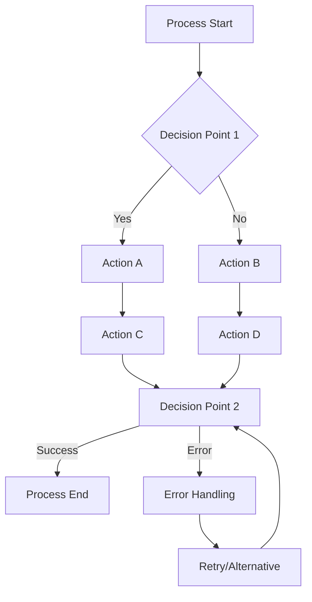

# Process Documentation Sample

This document demonstrates my ability to create clear, step-by-step process documentation that guides users through complex workflows.

## Overview

Process documentation is essential for ensuring consistency, reducing errors, and enabling knowledge transfer. This sample shows how I approach documenting complex processes in a way that's both comprehensive and easy to follow.

## 🛠️ **Step-by-Step: Creating Effective Process Documentation**

### **Step 1: Process Discovery & Analysis**

#### **1.1 Identify Process Stakeholders**
```markdown
**Who to Interview:**
- Process owners and managers
- End users who perform the process
- IT/system administrators
- Quality assurance team members
- External partners or vendors (if applicable)

**Interview Questions:**
1. What is your role in this process?
2. What are the main steps you follow?
3. What tools or systems do you use?
4. What challenges do you face?
5. What would make this process better?
6. Are there any compliance or security requirements?
```

#### **1.2 Map the Current Process**


#### **1.3 Document Process Metrics**
```markdown
**Key Metrics to Capture:**
- Process duration (average, min, max)
- Success rate and error frequency
- Resource requirements (time, people, tools)
- Cost per execution
- Customer satisfaction scores
- Compliance audit results
```

### **Step 2: Content Structure & Planning**

#### **2.1 Create Documentation Outline**
```markdown
**Standard Process Documentation Structure:**

1. **Process Overview**
   - Purpose and objectives
   - Scope and boundaries
   - Success criteria
   - Key stakeholders

2. **Prerequisites**
   - Required knowledge/skills
   - System access requirements
   - Tools and software needed
   - Training requirements

3. **Step-by-Step Instructions**
   - Numbered, sequential steps
   - Clear action statements
   - Expected outcomes
   - Screenshots or diagrams

4. **Decision Points & Branches**
   - If/then scenarios
   - Error handling procedures
   - Alternative paths
   - Escalation procedures

5. **Troubleshooting**
   - Common issues and solutions
   - Error messages and fixes
   - Contact information for help
   - Escalation procedures

6. **Best Practices & Tips**
   - Efficiency recommendations
   - Common mistakes to avoid
   - Pro tips from experienced users
   - Quality checkpoints

7. **Related Resources**
   - Links to related processes
   - Training materials
   - System documentation
   - Contact information
```

#### **2.2 Choose Appropriate Format**
```markdown
**Format Selection Criteria:**

**Confluence/Notion Pages:**
- ✅ Collaborative editing
- ✅ Version control
- ✅ Search functionality
- ❌ Limited formatting options

**Word/Google Docs:**
- ✅ Rich formatting
- ✅ Easy to print
- ✅ Familiar interface
- ❌ Poor version control

**Markdown/Git:**
- ✅ Version control
- ✅ Developer-friendly
- ✅ Easy to maintain
- ❌ Learning curve

**Video Documentation:**
- ✅ Visual demonstration
- ✅ Easy to follow
- ✅ Engaging format
- ❌ Hard to update
- ❌ Not searchable
```

### **Step 3: Content Creation**

#### **3.1 Write Clear, Actionable Steps**
```markdown
**Good Step Example:**
"Click the 'Create New Project' button in the top-right corner of the dashboard."

**Bad Step Example:**
"Create a new project."

**Better Step Example:**
"1. Navigate to the Projects section in the main menu
2. Click the 'Create New Project' button (green button, top-right)
3. Fill in the project name in the popup dialog
4. Click 'Save' to create the project
5. Verify the project appears in your project list"
```

#### **3.2 Include Visual Aids**
```markdown
**Types of Visual Aids:**
- Screenshots with annotations
- Process flow diagrams
- Decision trees
- Video demonstrations
- Interactive tutorials
- Infographics
```

#### **3.3 Add Context and Rationale**
```markdown
**Why Include Context:**
- Helps users understand the "why" behind steps
- Enables users to adapt when situations change
- Reduces errors from blind following
- Improves user confidence and engagement

**Example with Context:**
"Step 3: Select 'Production Environment' from the dropdown
   **Why this matters:** Using the production environment ensures your changes are applied to the live system that customers use. The staging environment is only for testing."
```

### **Step 4: Review & Validation**

#### **4.1 Multi-Stage Review Process**
```markdown
**Stage 1: Technical Review**
- Subject matter expert validation
- Accuracy check of all steps
- Tool and system verification
- Compliance requirement check

**Stage 2: User Testing**
- Test with actual end users
- Observe users following the process
- Collect feedback on clarity and usability
- Identify pain points and confusion

**Stage 3: Editorial Review**
- Grammar and style check
- Consistency with other documentation
- Formatting and structure review
- Accessibility compliance check

**Stage 4: Final Approval**
- Manager/supervisor sign-off
- Legal/compliance approval (if needed)
- Publication readiness check
- Distribution planning
```

#### **4.2 Validation Checklist**
```markdown
**Content Validation:**
- [ ] All steps are accurate and current
- [ ] Screenshots match current system version
- [ ] Links are working and up-to-date
- [ ] Contact information is correct
- [ ] Compliance requirements are met

**Usability Validation:**
- [ ] Process can be completed by target users
- [ ] Average completion time is reasonable
- [ ] Error rate is acceptable
- [ ] Users can recover from mistakes
- [ ] Process meets business objectives

**Quality Validation:**
- [ ] Writing is clear and concise
- [ ] Formatting is consistent
- [ ] Navigation is intuitive
- [ ] Search functionality works
- [ ] Mobile accessibility is adequate
```

### **Step 5: Publication & Maintenance**

#### **5.1 Publication Strategy**
```markdown
**Publication Checklist:**
- [ ] Content is approved and ready
- [ ] All stakeholders are notified
- [ ] Training materials are prepared
- [ ] Support team is briefed
- [ ] Feedback collection system is in place
- [ ] Analytics tracking is configured
```

#### **5.2 Maintenance Schedule**
```markdown
**Regular Maintenance Tasks:**

**Monthly:**
- Review user feedback and analytics
- Check for broken links
- Update contact information
- Review error reports

**Quarterly:**
- Full content accuracy review
- Update screenshots if system changed
- Review and update related resources
- Analyze usage patterns and user feedback

**Annually:**
- Complete process review and update
- Stakeholder interviews for improvements
- Technology and tool updates
- Compliance requirement review
```

### **Step 6: Continuous Improvement**

#### **6.1 Feedback Collection**
```markdown
**Feedback Sources:**
- User surveys and interviews
- Support ticket analysis
- Analytics data (time on page, completion rates)
- Manager and stakeholder feedback
- Process performance metrics

**Feedback Questions:**
1. Was this process easy to follow?
2. Did you encounter any unclear steps?
3. How long did it take to complete?
4. What would you change about this process?
5. Did you need additional help or resources?
```

#### **6.2 Process Optimization**
```markdown
**Optimization Opportunities:**
- Eliminate unnecessary steps
- Automate repetitive tasks
- Improve error handling
- Add shortcuts for experienced users
- Enhance visual aids and examples
- Streamline approval processes
```

## 📊 **Process Documentation Best Practices**

### **Writing Guidelines**
```markdown
**Clear and Concise:**
- Use active voice
- Write in present tense
- Use simple, direct language
- Avoid jargon and acronyms
- Be specific and detailed

**User-Centered:**
- Write for the end user's skill level
- Include context and rationale
- Anticipate common questions
- Provide multiple learning paths
- Include troubleshooting help

**Consistent Format:**
- Use consistent numbering and formatting
- Follow established style guidelines
- Use standard terminology
- Maintain consistent tone
- Follow template structure
```

### **Visual Design Principles**
```markdown
**Effective Visual Design:**
- Use white space effectively
- Highlight important information
- Use consistent color coding
- Include clear navigation
- Make content scannable

**Accessibility:**
- Use alt text for images
- Ensure color contrast compliance
- Support screen readers
- Provide text alternatives for videos
- Use clear, readable fonts
```

### **Quality Assurance**
```markdown
**Quality Checklist:**
- [ ] All steps are accurate and tested
- [ ] Screenshots are current and clear
- [ ] Links work and are relevant
- [ ] Grammar and spelling are correct
- [ ] Formatting is consistent
- [ ] Content is complete and comprehensive
- [ ] User feedback has been incorporated
- [ ] Compliance requirements are met
```

## Documentation Process Workflow

### 1. Discovery Phase

**Objective**: Understand the process from multiple perspectives

**Steps**:
1. **Stakeholder Interviews**
   - Identify all process participants
   - Schedule 30-45 minute interviews
   - Prepare open-ended questions
   - Document pain points and success criteria

2. **Process Mapping**
   - Create visual flowcharts
   - Identify decision points and branches
   - Note dependencies and handoffs
   - Validate with subject matter experts

3. **Tool Analysis**
   - Document all systems involved
   - Capture screenshots and interfaces
   - Note version numbers and configurations
   - Identify integration points

### 2. Documentation Phase

**Objective**: Create clear, actionable documentation

**Content Structure**:
- **Overview**: High-level process description
- **Prerequisites**: Required knowledge, tools, access
- **Step-by-Step Instructions**: Detailed, numbered steps
- **Troubleshooting**: Common issues and solutions
- **Best Practices**: Tips for success
- **Related Resources**: Links to additional information

### 3. Review and Validation

**Objective**: Ensure accuracy and usability

**Review Process**:
1. **Technical Review**: Subject matter expert validation
2. **User Testing**: Test with actual process users
3. **Editorial Review**: Grammar, clarity, consistency
4. **Final Approval**: Stakeholder sign-off

## Writing Guidelines

### Clarity Principles

- **Use active voice**: "Click the Submit button" not "The Submit button should be clicked"
- **Be specific**: "Enter your email address" not "Enter your information"
- **Avoid jargon**: Use plain language when possible
- **Include context**: Explain why each step matters

### Visual Design

- **Consistent formatting**: Use the same style for similar elements
- **White space**: Don't overcrowd the page
- **Visual hierarchy**: Use headings, lists, and emphasis appropriately
- **Screenshots**: Include relevant images with clear annotations

### User Experience

- **Progressive disclosure**: Start simple, add complexity gradually
- **Error prevention**: Anticipate common mistakes
- **Quick reference**: Include summary sections for experienced users
- **Searchability**: Use keywords that users would search for

## Example: User Onboarding Process

### Prerequisites

Before starting the onboarding process, ensure you have:
- Valid email address
- Company domain access
- Required software installed
- Manager approval

### Step 1: Account Creation

1. Navigate to the [user portal](https://portal.example.com)
2. Click **Create Account**
3. Enter your company email address
4. Check your email for verification link
5. Click the verification link to activate your account

:::tip Pro Tip
Use your company email address to ensure proper access permissions are applied automatically.
:::

### Step 2: Profile Setup

1. Log into your account
2. Click **Profile Settings**
3. Complete the following fields:
   - Full name
   - Department
   - Manager email
   - Phone number
4. Upload a professional headshot
5. Click **Save Profile**

### Step 3: Access Request

1. From your dashboard, click **Request Access**
2. Select the systems you need:
   - [ ] Email system
   - [ ] Project management
   - [ ] Development tools
   - [ ] Design software
3. Provide business justification
4. Submit request

:::warning Important
Access requests require manager approval and may take 24-48 hours to process.
:::

### Troubleshooting

**Issue**: Verification email not received
- **Solution**: Check spam folder, request resend, contact IT support

**Issue**: Access request denied
- **Solution**: Review business justification, consult with manager, resubmit

**Issue**: Profile photo upload fails
- **Solution**: Ensure image is under 2MB and in JPG/PNG format

## Best Practices

### For Process Documentation

1. **Test everything**: Follow your own instructions
2. **Update regularly**: Keep documentation current with process changes
3. **Gather feedback**: Ask users what's missing or confusing
4. **Version control**: Track changes and maintain history
5. **Accessibility**: Ensure documentation works for all users

### For Technical Writing

1. **Know your audience**: Write for the intended user level
2. **Be consistent**: Use the same terminology throughout
3. **Include examples**: Show, don't just tell
4. **Anticipate questions**: Address common concerns proactively
5. **Make it scannable**: Use headings, lists, and formatting for easy navigation

## Metrics and Success

### Key Performance Indicators

- **Time to completion**: How long does the process take?
- **Error rate**: How often do users make mistakes?
- **Support tickets**: Are users asking questions about the process?
- **User satisfaction**: Do users find the documentation helpful?

### Continuous Improvement

- **Regular reviews**: Schedule quarterly documentation audits
- **User feedback**: Collect and analyze user comments
- **Process optimization**: Identify and eliminate unnecessary steps
- **Tool updates**: Keep documentation current with system changes

---

*This process documentation sample demonstrates my ability to create comprehensive, user-friendly guides that enable successful process execution while reducing support burden and improving user experience.*
