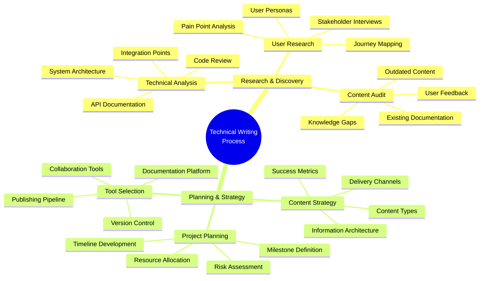
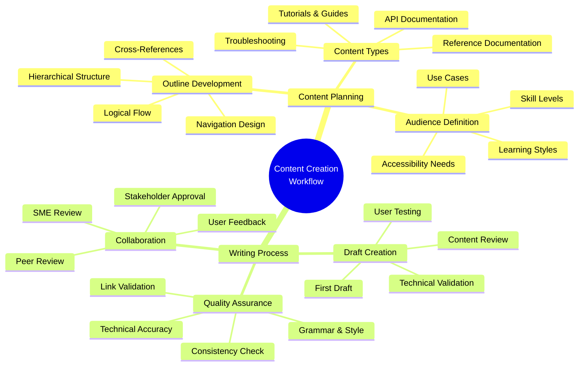
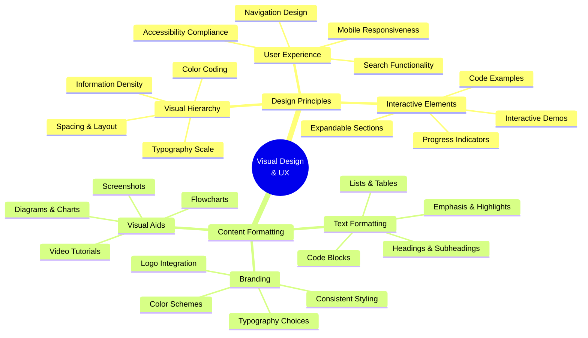
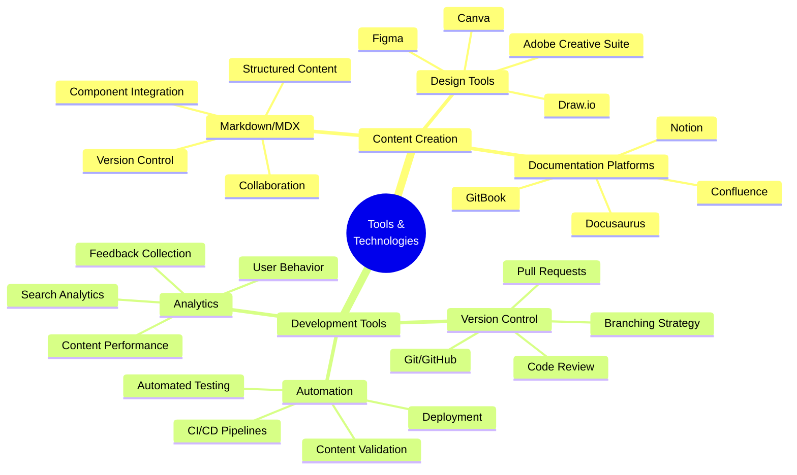
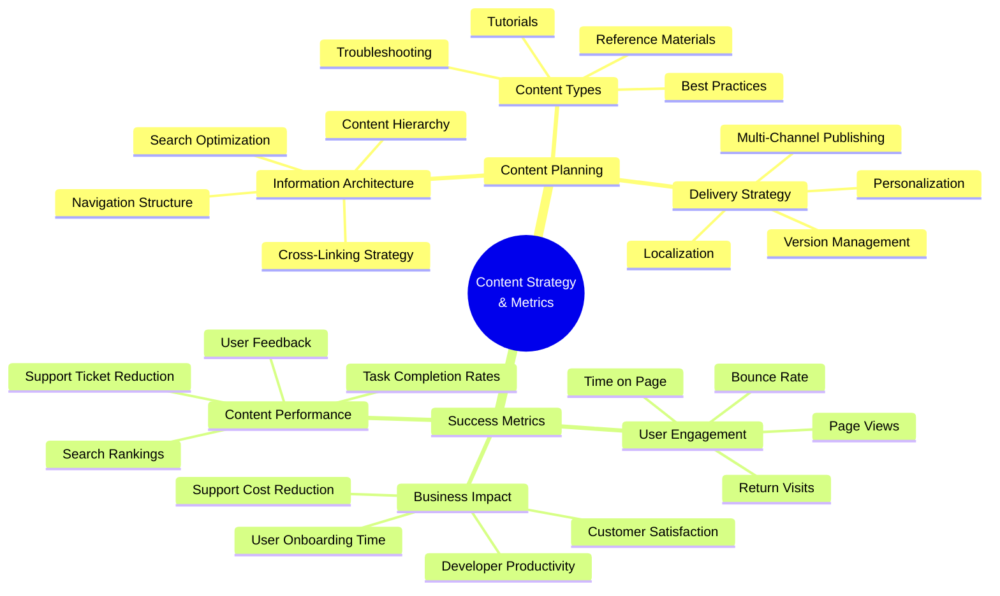
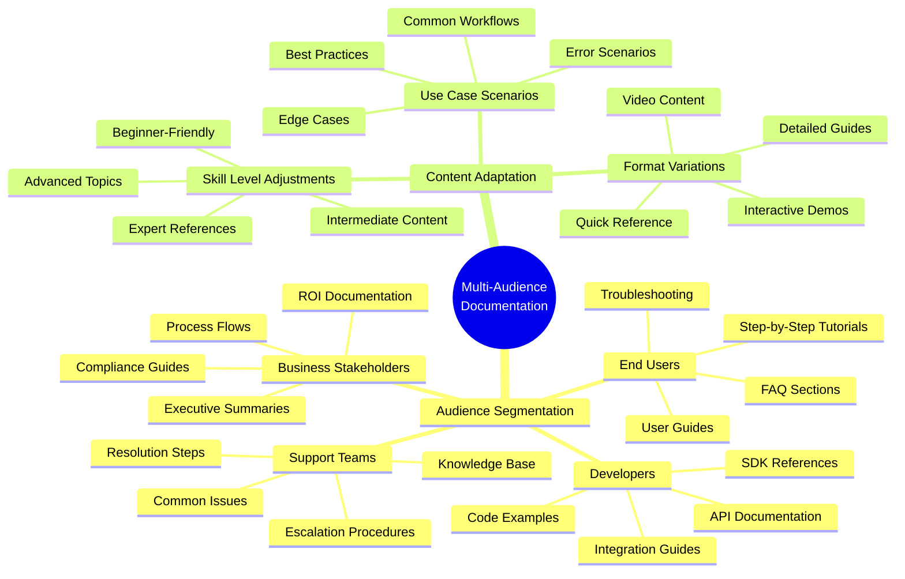
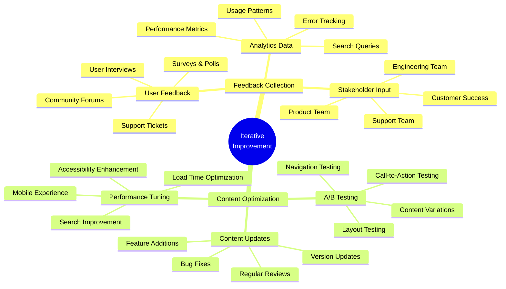
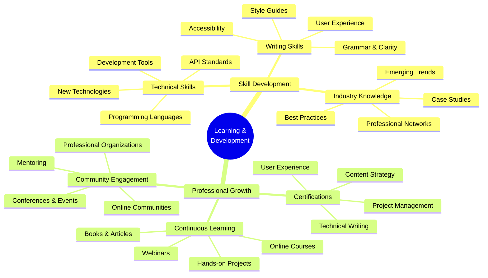
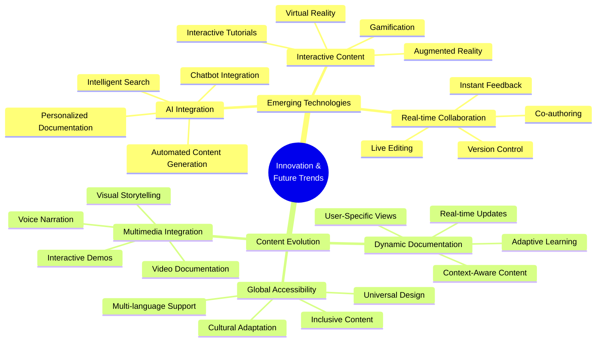

# Technical Writing Process Mind Map

This comprehensive mind map illustrates my approach to technical writing, from initial research through content delivery and continuous improvement.

## Overview

Technical writing is a systematic process that combines user research, content strategy, and iterative improvement to create documentation that truly serves its audience. This visual guide shows how I approach complex documentation projects.

## 🎯 Technical Writing Process Mind Map

### The Complete Writing Workflow

## 📝 Content Creation Workflow

### From Concept to Publication

## 🎨 Visual Design & UX

### Creating Engaging Documentation

## 🔧 Tools & Technologies

### Modern Documentation Stack

## 📊 Content Strategy & Metrics

### Measuring Documentation Success

## 🌐 Multi-Audience Documentation

### Serving Diverse User Groups

## 🔄 Iterative Improvement

### Continuous Documentation Enhancement

## 🎓 Learning & Development

### Staying Current in Technical Writing

## 🚀 Innovation & Future Trends

### The Future of Technical Documentation

## 💡 Creative Problem Solving

### Visual Thinking in Technical Writing

**🎨 Why Visual Approaches Work:**
- **Complex Information**: Break down intricate technical concepts into digestible visual elements
- **Pattern Recognition**: Help users identify relationships and connections between different concepts
- **Memory Aids**: Visual elements improve retention and recall of technical information
- **Cross-Functional Communication**: Bridge gaps between technical and non-technical stakeholders

**🛠️ Implementation Strategies:**
- **Mind Maps**: Organize complex topics and show relationships
- **Flowcharts**: Illustrate processes and decision trees
- **Diagrams**: Explain system architecture and data flow
- **Infographics**: Present statistics and key information visually

**📈 Measurable Benefits:**
- **Reduced Learning Time**: Visual learners process information 60% faster
- **Improved Comprehension**: Visual aids increase understanding by 400%
- **Better Retention**: Users remember 80% of what they see vs. 20% of what they read
- **Enhanced Engagement**: Interactive visual content increases user engagement by 300%

---

*This mind map demonstrates my holistic approach to technical writing, combining analytical thinking with creative problem-solving to create documentation that truly serves users. The visual format makes complex processes accessible and memorable, while showcasing my ability to think both systematically and creatively.*
